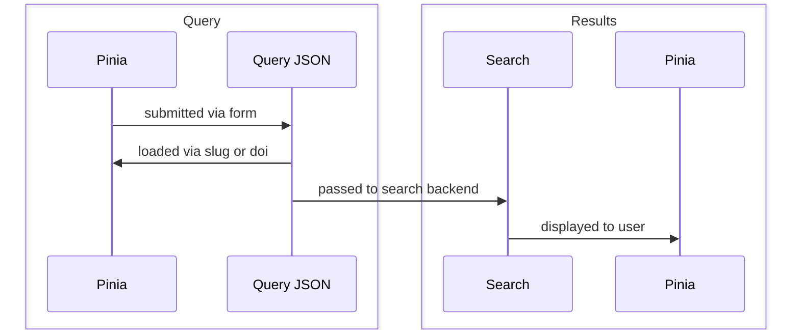
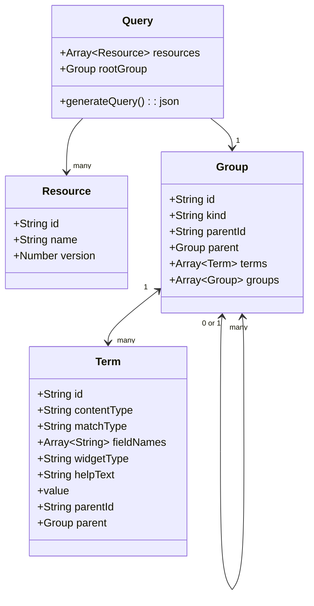
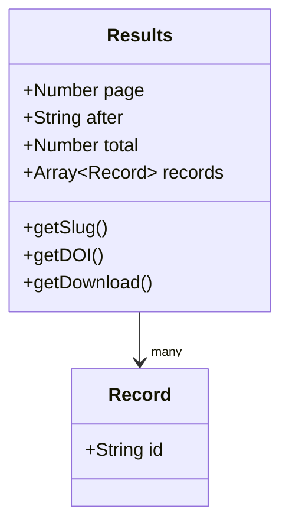

**NB: This document is a work in progress. It is incomplete and subject to change frequently and/or drastically.** :sparkles:

# Overview

# Query in Pinia

# Query JSON

The Pinia query will be translated into a JSON object defined by the query schema in [ckanext-versioned-datastore](https://github.com/NaturalHistoryMuseum/ckanext-versioned-datastore/tree/main/ckanext/versioned_datastore/theme/public/querySchemas). Documentation can also be found [on the Data Portal](https://data.nhm.ac.uk/api.html).

# Search

The query JSON is passed on to the [Data Portal API](https://data.nhm.ac.uk/api.html).

# Results in Pinia

